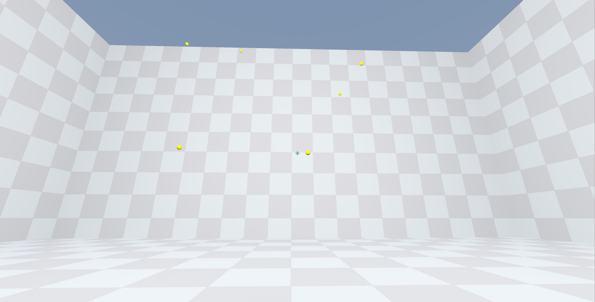

# OpenAimTrainer
🎯 **Open Aim Trainer** is a free and open source aim trainer that allows you to improve your aim in both 2D and 3D games. It is made with the **Godot game engine**, which is a free and open source game engine that is easy to learn and use.

It features a variety of different training modes, including:

🧍 **Static targets**: These targets stay in one place, so you can focus on improving your accuracy.

🏃 **Moving targets**: These targets move around, so you need to track them with your crosshair.

⚙️ Open Aim Trainer also features a variety of customization options, so you can tailor the training to your specific needs. You can choose the type of targets, the speed of the targets, and the scoring system.

🏆 Whether you're a beginner or a pro, Aim Trainer is a great way to improve your aim in any game. It's free, open source, and easy to use. So what are you waiting for? Start training today!



### Features:

🏎️ Made with the Godot game engine

👟 Variety of training modes

⚙️ Customizable settings

🆓 Free and open source

### Benefits:

🎯 Improve your aim in any game

🤯 Tailor the training to your specific needs

💪 Easy to use

### Get started:

⏬ Download the latest version of Open Aim Trainer

🖥️ Install the game on your computer

🏁 Start training!

### For more information:

🌐 Visit the Open Aim Trainer website [Website](https://openaimtrainer.com/)

💬 Join the Open Aim Trainer Discord server [Discord](https://discord.com/invite/bbKAEF6QQs)


### Basic structure
```
/project-root
├── project.gd
├── README.md
├── assets
│   ├── images
│   ├── sounds
│   ├── fonts
│   └── models
├── scenes
│   ├── ui
│   ├── characters
│   └── levels
├── scripts
│   ├── ui
│   ├── characters
│   └── levels
└── resources
	└── shaders
```
