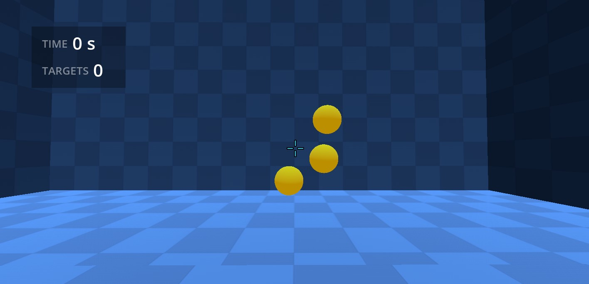

# Libre Aim

	

Free and open source FPS aim trainer made with Godot.

- **✏️ Customizable**: There are other aim trainers out there, but Libre Aim is open source, so anyone can trully customize all the aspects of it. Everything should be simple, easy to mantain and modify. 
- **🕊️ Lightweight**: This is a training tool, it doesn't need fancy graphics, but it needs to run on low-end machines, give a high ammount of fps, and have minimal input lag.

> Libre Aim is currently in a very early stage of development, so don't expect too much out of it, it was originally forked from [Open Aim Trainer](https://github.com/erkkon/OpenAimTrainer).

## Free, open source
Libre Aim is open source. Feel free to do whatever you want with it: Fork it, modify it,  use the code for other projects...

You can also contribute to the project and make pull requests. It currently uses Godot 4.2

